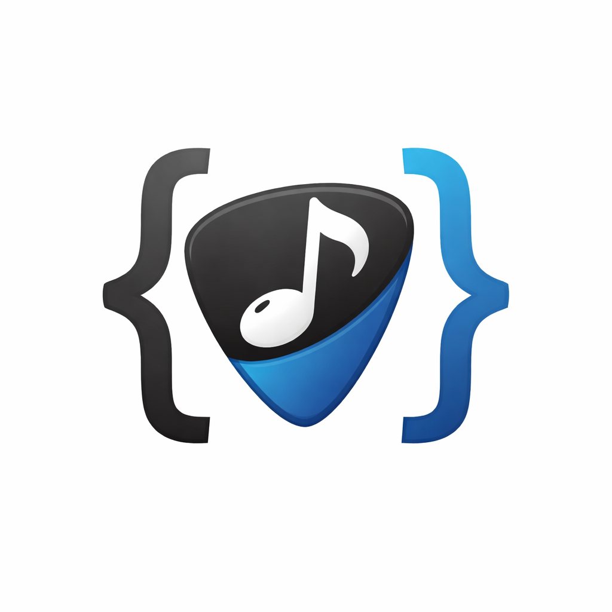
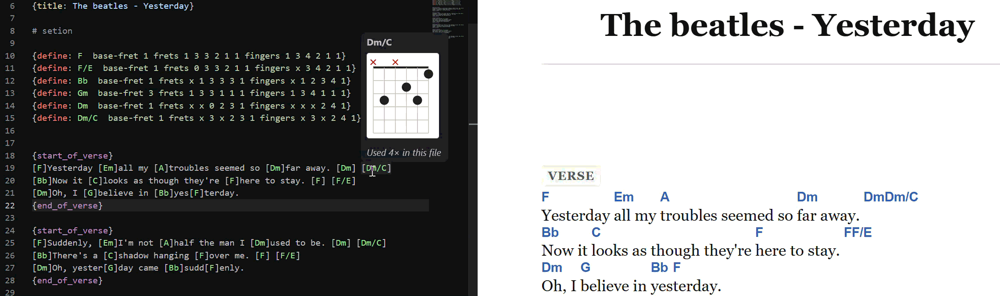
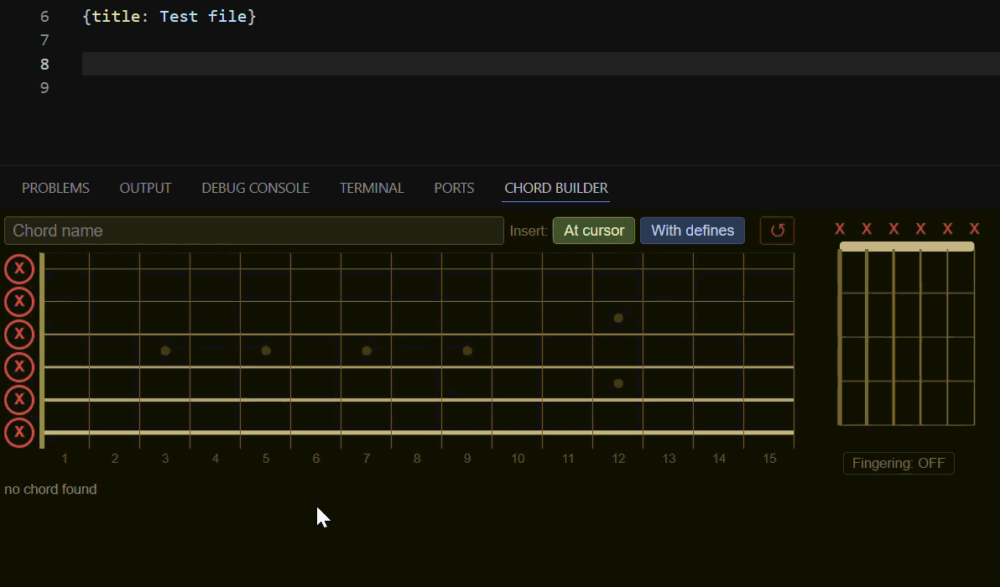
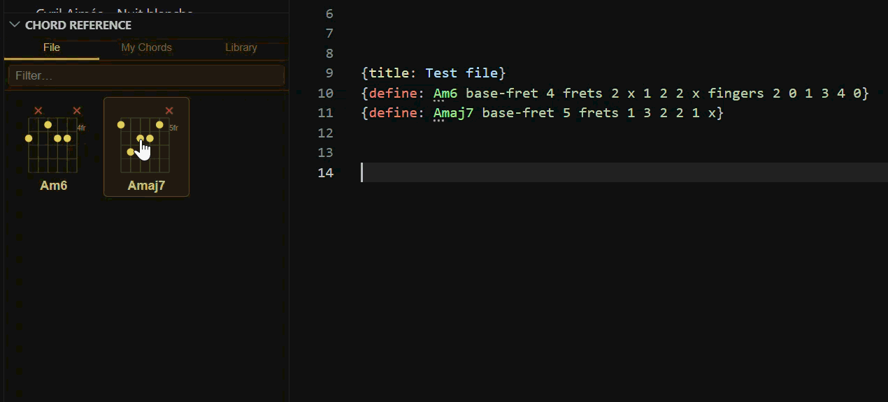
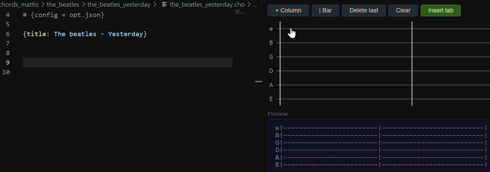
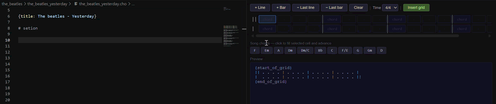

<p align="center">
  
</p>

# ChordPro VSCode

**Write, rehearse, and perform your songs — without leaving VSCode.**

[](https://marketplace.visualstudio.com/items?itemName=mattjs07.chordpro-vscode)
[](https://open-vsx.org/extension/mattjs07/chordpro-vscode)

Available on both the **[VS Code Marketplace](https://marketplace.visualstudio.com/items?itemName=mattjs07.chordpro-vscode)** and **[OpenVSX](https://open-vsx.org/extension/mattjs07/chordpro-vscode)** (for VSCodium, Gitpod, and other open-source VSCode distributions).

ChordPro VSCode turns VSCode into a full-featured songwriting and performance environment. Write `.cho` files with rich auto-completion, visualise chord fingerings instantly, scroll through your setlist hands-free, and generate print-ready PDFs — all from the editor you already use.

---

## Highlights

| | |
|---|---|
| 🎸 **Chord diagrams everywhere** | Hover over any `[chord]` in the source *or* in the live preview to see an SVG fretboard diagram |
| 🎛 **Smart Chord Builder** | Click strings and frets on an interactive fretboard; the chord name is detected automatically; the builder learns from your own voicings and validates names before inserting; hear the chord with built-in audio playback |
| 📖 **Chord Reference Panel** | Sidebar panel with three tabs — chords in the current file, your personal chord library, and the full built-in library; click to insert, Ctrl+click for diagram, right-click for options |
| 🗂 **My Chords** | Automatically tracks every `{define:}` across all files you work on; stores multiple voicings per chord; navigate, delete, and sort your personal collection |
| 🎼 **Visual Tab Editor** | Build guitar tablature by clicking a grid — no dashes to type |
| 🎹 **Visual Grid Editor** | Build `{start_of_grid}` chord progression blocks visually — multi-beat cells, song chord palette, hover diagrams |
| 📜 **Performance View** | Full-screen HTML view with auto-scroll, tap tempo, metronome, section jump, live transpose, and more |
| 🎵 **Song Library & Setlist** | Browse your entire song folder, select a few songs, and launch a live setlist with one click |
| 🔄 **Transpose** | Shift chords by any interval in the source, or preview in a different key without touching the file |
| 🔍 **Chord Analyzer** | Open Oolimo's chord analyzer in a side panel, without leaving VSCode |
| 🥁 **Metronome** | Web Audio click track that locks to `{tempo:}` or tap tempo — no external app needed |

---

## GIF Showcase

### Performance View


### Chord Diagram Hover — source file & HTML preview


### Chord Builder


### Chord Reference Panel


### Tab Editor


### Song Library & Setlist


### Grid Editor


---

## Quick Start

1. Install the extension and open (or create) a `.cho` file — syntax highlighting activates automatically
2. Press `Ctrl+Alt+P` to open the **Performance View** (no CLI needed), or `Ctrl+Shift+V` for the **PDF preview**
3. Press **Space** to start scrolling — use the control bar to adjust speed, transpose, or jump to a section

PDF rendering requires the [ChordPro CLI](https://www.chordpro.org/chordpro/chordpro-installation/) installed and on your PATH. For the ChordPro format itself, see the [official documentation](https://www.chordpro.org/chordpro/home/).

---

## Commands & Shortcuts

### Performance & Preview

| Command | Shortcut | Description |
|---|---|---|
| ChordPro: Performance View | `Ctrl+Alt+P` | Render the song as HTML and open the performance view |
| ChordPro: Open Chord Analyzer | `Ctrl+Alt+A` | Open Oolimo in a side panel |
| ChordPro: Preview PDF | `Ctrl+Shift+V` | Render and open the PDF beside the editor |
| ChordPro: Render PDF | `Ctrl+Shift+B` | Compile the active `.cho` file to PDF |

### Auto-scroll controls (inside the preview)

| Key | Action |
|---|---|
| `Space` | Play / Pause |
| `↑` / `↓` | Faster / Slower (±5 px/s) |
| `T` | Tap tempo — sets scroll speed from your rhythm |
| `M` | Toggle metronome |
| `L` | Lyrics-only mode — hide chord symbols |
| `§` button | Section jump — click any section to scroll there |
| `F` | Full-screen (works in saved HTML / browsers) |
| `♭` / `♯` buttons | Live transpose — shift chords in the view without editing the file |
| `⊞` button | Two-column layout |
| `♩` button | Snap scroll speed back to tempo speed |
| `A−` / `A+` | Font size |
| `🌙` / `☀️` | Toggle dark / light theme |
| `💾` | Save as standalone HTML |

### Editing & Writing

| Command | Shortcut | Description |
|---|---|---|
| ChordPro: Open Chord Builder | `Ctrl+Alt+B` | Interactive fretboard panel to build and insert chord fingerings |
| ChordPro: Insert Title | — | Insert a `{title: }` directive at the cursor |
| ChordPro: Insert Chord Inline | `Ctrl+I` | Fuzzy-search your chords and insert `[CHORD]` at the cursor |
| ChordPro: Insert Chord Diagram | `Ctrl+Shift+D` | Same picker, inserts `{chord: CHORD}` |
| ChordPro: Open Tab Editor | `Ctrl+Alt+T` | Visual tab editor — click cells, type fret numbers |
| ChordPro: Open Grid Editor | `Ctrl+Alt+G` | Visual chord grid editor — build `{start_of_grid}` blocks with a click-to-fill UI, with hover diagrams |
| ChordPro: Transpose Chords | — | Shift all chords (or a selection) by any number of semitones |
| ChordPro: Capo Helper (Concert Pitch) | — | Show the chords other instruments hear given the current `{capo:}` |
| ChordPro: Detect Key | — | Analyse all chords and suggest the key; optionally insert `{key:}` |

### Song Library & Setlist

| Command | Description |
|---|---|
| ChordPro: Set Library Folder (`📂` button) | Choose the root folder containing your `.cho` files (subfolders are scanned recursively) |
| ChordPro: Refresh Library (`⟳` button) | Re-scan the library folder |
| ChordPro: Play as Setlist (`▶` button) | Open selected songs (or all songs) in the Setlist Preview |
| Click a song | Open the `.cho` file in the editor |
| Right-click a song → Preview | Open the song in the Performance View |

**Setlist navigation:**

| Key | Action |
|---|---|
| `PageUp` / `PageDown` | Previous / Next song |
| `◀` / `▶` buttons | Previous / Next song |
| **Auto** button | Auto-advance to the next song when scroll reaches the end |

### Templates & Configuration

| Command | Description |
|---|---|
| ChordPro: New Minimal Template | Blank template to start a new song |
| ChordPro: New Example Template | Example file (Yesterday by The Beatles) |
| ChordPro: Configure Rendering | Guided UI for config, options, suffix, output (also via ⚙ CodeLens above line 1) |
| ChordPro: Create Config | Create a new named `.json` config file in your user configs folder |
| ChordPro: Import Config to User Library | Copy an existing `.json` file into your user configs folder |
| ChordPro: Edit Config | Open a user config file for editing |
| ChordPro: Set User Configs Folder | Choose the folder where your personal config files are stored (defaults to VS Code global storage) |

---

## Feature Details

### Chord Diagram Hover

Hover over any `[chord]` token — in your `.cho` source file *or* in the Performance View — to see an SVG fretboard diagram popup.

- Built-in library of ~100 chords (all roots × major, minor, 7th, maj7, sus, dim, aug, 6, 9, 11, 13, m7b5, mmaj7, 69, and more)
- `{define:}` blocks in the file take priority over the built-in library
- Chords saved via the Chord Builder also override the built-in defaults
- The hover tooltip also shows how many times the chord appears in the song

### Performance View

Press `Ctrl+Alt+P` to render the song as HTML and open it in a clean, distraction-free performance view. No ChordPro CLI needed.

- **Tempo-based speed** — add `{tempo: 120}` to your file; scroll speed is calculated automatically so the song passes at the right pace. A `♩` button snaps back to tempo speed at any time.
- **Tap tempo** — tap `T` repeatedly to set BPM from your rhythm; averaged over the last 8 taps.
- **Metronome** — `M` key or `♪` button; Web Audio click track locked to the current BPM (from `{tempo:}` or tap tempo); beat 1 accented.
- **Live transpose** — `♭` / `♯` buttons shift all chord names in the view without touching the source file.
- **Section jump** — `§` button opens a numbered list of all sections; click to scroll smoothly.
- **Lyrics-only mode** — `L` key hides chord symbols while preserving layout.
- **Auto-reload on save** — the preview refreshes automatically every time you save, restoring scroll position.
- **Save as HTML** — `💾` button saves a fully self-contained `_preview.html` to disk; all controls work in any browser.

### Song Library & Setlist

Open the **Song Library** panel in the activity bar (music note icon).

1. Click `📂` to set your library folder — all `.cho` files in subfolders are found automatically
2. Songs are listed by title (from `{title:}`) with the artist as a subtitle
3. **Ctrl+click** or **Shift+click** to select specific songs
4. Click `▶` **Play as Setlist** to open the selected songs (or all songs if none are selected) in the Setlist Preview
5. In the Setlist Preview, use `PageUp` / `PageDown` or the `◀ ▶` buttons to navigate; enable **Auto** to advance automatically at the end of each song
6. The setlist can be saved as a standalone HTML file with the `💾` button

### Chord Reference Panel

Open from the **ChordPro Library** activity bar icon — the **Chord Reference** view appears below the Song Library.

Three tabs:

| Tab | Contents |
|---|---|
| **File** | Every chord currently defined or used in the open `.cho` file |
| **My Chords** | Your personal chord library — built automatically from every `{define:}` block across all files you work on |
| **Library** | The full built-in library of ~100 standard voicings |

**Interacting with chord cards:**

- **Click** a card to insert `[CHORD]` inline at the cursor; if the chord has no `{define:}` in the file yet, one is inserted automatically in the header
- **Ctrl+click** to insert `{chord: CHORD}` (diagram directive) instead
- **Right-click** for a context menu with both insert options
- **◀ ▶ arrows** to cycle through multiple voicings of the same chord
- **× button** (hover over a card) to delete a voicing — choose to remove just that voicing or all voicings of the chord
- **Search bar** filters all tabs by chord name (fuzzy matching)
- **A↕ / #↕ toggle** (My Chords tab) to sort alphabetically or by frequency of use
- **Hover tooltip** shows which files the chord was found in

**My Chords tracking** — every `{define:}` you write or save is tracked automatically. Voicings from `{define:}` blocks, the Chord Builder, and the built-in library are merged and deduplicated per chord name. Saving a file updates My Chords immediately.

### Chord Builder

Open with `Ctrl+Alt+B` or from the panel at the bottom.

- Click strings and frets to place fingers on the fretboard; drag across strings to place the same fret on multiple strings
- **Auto-detect** — the chord name fills in automatically as you place fingers; fret dots show the note name (e.g. C#) or the interval relative to the root (1, m3, 5, b7…) — toggle with the Notes / Intervals switch
- **Smart voicing memory** — every chord you insert is remembered as a shape. Next time you play the same fingering (or a barre-transposed version), your name appears as a ★ suggestion. Click × to forget a shape.
- **Name validation** — any insert button validates the chord name first:
  - *Unknown name*: suggests the closest recognized chord names; click one to re-validate instantly
  - *Note mismatch*: lists the notes the name requires but the voicing is missing
  - *Wrong root*: if the shape is a valid voicing of the same chord quality on a different root (e.g. you typed Cmaj6 but the fingering is Dmaj6), the correct root is suggested automatically
- **Audio playback** — click 🔊 (or press `P`) to hear the chord: strings are plucked one by one from low E to high e, then a quick full strum rings out (Karplus-Strong synthesis, no external library)
- **Fingering mode** — toggle to assign finger numbers (1–4) by clicking the fret dots
- **Inline** — inserts `[CHORD]` at the cursor; **{chord:}** inserts the directive and adds a `{define:}` block; **{define:}** adds the define block only
- **↺ Reset** — clears the fretboard; **−1 / +1** shift all frets down or up by one semitone; **Ctrl+Z / Ctrl+Shift+Z** undo/redo fret changes
- **Open in Builder** — hover over any `[chord]` or `{define:}` line and click the link to load that chord's fingering directly into the Builder
- Saved chords appear at the top of the `[` auto-completion list and in chord hover diagrams

### Tab Editor

Open with `Ctrl+Alt+T`.

- Click any cell to select it, then type the fret number (0–24)
- `Backspace` clears a cell; `Enter` / `→` advances to the next column; `↑` / `↓` moves between strings
- **+ Column** inserts a new column after the selected position
- **| Bar** inserts a bar line; **Delete last** removes the rightmost column; **Clear** empties all values
- A live tab preview is shown below the grid
- **Insert tab** wraps the result in `{start_of_tab}` / `{end_of_tab}` and inserts it at the cursor position in the source file

### Grid Editor

Open with `Ctrl+Alt+G`.

Build `{start_of_grid}` chord progression grids visually:

- Each row is a line of the grid; each bar has one input per beat
- Beat 1 (primary chord) is larger; beats 2–4 are smaller — visually distinct
- Click a cell (or use `Tab` / `Shift+Tab` / arrow keys) to select it, then type the chord name
- **Song chords palette** — all `[chord]` tokens found in the open song are shown as buttons at the bottom; click any to fill the selected cell and auto-advance to the next beat
- **+ Line** / **− Last line** add or remove rows; **+ Bar** / **− Last bar** add or remove columns across all rows
- **Time** selector sets the time signature (4/4, 3/4, 2/4)
- First row starts with `||`, last row ends with `||`; all others use single `|`; empty beats render as `.`
- Live preview updates as you type
- **Insert grid** wraps the result in `{start_of_grid}` / `{end_of_grid}` and inserts it at the cursor

### Chord hover in grids

Chord names inside `{start_of_grid}` blocks are fully interactive — both in the source file and in the HTML preview:

- **Source file** — chord names are syntax-highlighted in green (same as `[chord]` tokens); hover for the SVG diagram popup
- **HTML preview** — chord names are bold and colored; hover for the diagram tooltip
- Custom chords defined via `{define:}` in the file are recognized with their fingering diagram

### Transposing

**Live transpose (preview only):** use the `♭` / `♯` buttons in the Performance View or Setlist preview to shift chord display without modifying the source.

**Permanent transpose (source file):** command palette → **Transpose Chords** — pick a musical interval or enter a custom number of semitones. Updates all `[chord]` tokens and `{key:}` directives. Undoable with `Ctrl+Z`.

**For PDF only:** add `{transpose: 2}` in the file; the CLI applies it at render time without changing the source (note: the HTML preview ignores this directive).

### Syntax Highlighting

`.cho`, `.chordpro`, and `.chopro` files get full syntax highlighting automatically: chord tokens `[Am]`, directives `{title:}`, section markers, comments, and rendering parameters are all coloured distinctly.

### Auto-completion

- Type `{` → suggestions for all ChordPro directives; section pairs (`{start_of_chorus}` etc.) insert the closing tag automatically with the cursor placed between them
- Type `[` → chord suggestions; your saved and defined chords appear first
- Rendering parameters (`# {config = ...}`, etc.) have their own completions in the first 25 lines

### Rendering Parameters (PDF config)

Add these in the **first 25 lines** of your `.cho` file to control how the PDF is generated:

```
# {config = "modern1"}
# {options = --no-chord-grids}
# {suffix = "chords_only"}
# {output = mysong_out.pdf}
```

| Parameter | Description |
|---|---|
| `config` | Preset name (`modern1`, `dark`, …) or path to a `.json` config file |
| `options` | Extra CLI flags passed verbatim (e.g. `--no-chord-grids`, `-l`, `--toc`) |
| `suffix` | Appended to the output filename: `mysong_<suffix>.pdf` |
| `output` | Full output filename, overrides the default |

**Three ways to configure:**
- **Auto-completion** — type `# {` in the first 25 lines for a dropdown of parameters; `config` offers a preset picker
- **Hover tooltip** — hover over a `# {key = ...}` line to see a description, valid values, and common CLI flags
- **⚙ CodeLens** — click the **⚙ Configure rendering** button above line 1 for a guided step-by-step UI

### User Config Library

The `config` picker in **⚙ Configure rendering** shows three tiers:

- **My configs** — your personal `.json` files, stored in a folder of your choice
- **Extension presets** — configs bundled with the extension (e.g. *two columns*)
- **ChordPro built-in presets** — `modern1`, `dark`, `nashville`, etc.

Manage your personal configs via the `ChordPro: …` commands in the palette:

| Command | What it does |
|---|---|
| **Create Config** | Prompts for a name, creates a new `.json` and opens it for editing |
| **Import Config to User Library** | File picker — copies any existing `.json` into your user configs folder |
| **Edit Config** | Pick a saved config from a list and open it |
| **Set User Configs Folder** | Folder picker — point to any location (Dropbox, network drive, etc.) |

The folder defaults to VS Code's global storage and is created automatically on first use.

### Chord Analyzer (Oolimo)

Press `Ctrl+Alt+A` to open [Oolimo](https://www.oolimo.com/en/guitar-chords/analyze) in a VSCode side panel — look up any chord, explore voicings, and analyse progressions without leaving the editor.

---

## Requirements

PDF rendering requires the [ChordPro CLI](https://www.chordpro.org/chordpro/chordpro-installation/) installed and on your system PATH.

The **Performance View**, **Song Library**, **Setlist**, **Chord Builder**, **Chord Reference**, **Tab Editor**, and **Chord Analyzer** all work without the CLI.

---

## Useful Links

- [VS Code Marketplace listing](https://marketplace.visualstudio.com/items?itemName=mattjs07.chordpro-vscode)
- [OpenVSX listing](https://open-vsx.org/extension/mattjs07/chordpro-vscode)
- [ChordPro official site & documentation](https://www.chordpro.org/chordpro/home/)
- [ChordPro directive reference](https://www.chordpro.org/chordpro/chordpro-directives/)
- [Oolimo chord analyzer](https://www.oolimo.com/en/guitar-chords/analyze)
- [Songcraft.io](https://songcraft.io/) — BPM, autoscrolling, visual editor, chord progressions
- [Full Changelog](CHANGELOG.md)

---

## Suggestions & Feedback

Have an idea, found a bug, or want to request a feature? Open an issue on [GitHub](https://github.com/mattjs07/chordpro_vscode/issues) — all suggestions are welcome!

---

**Enjoy your playing!**
